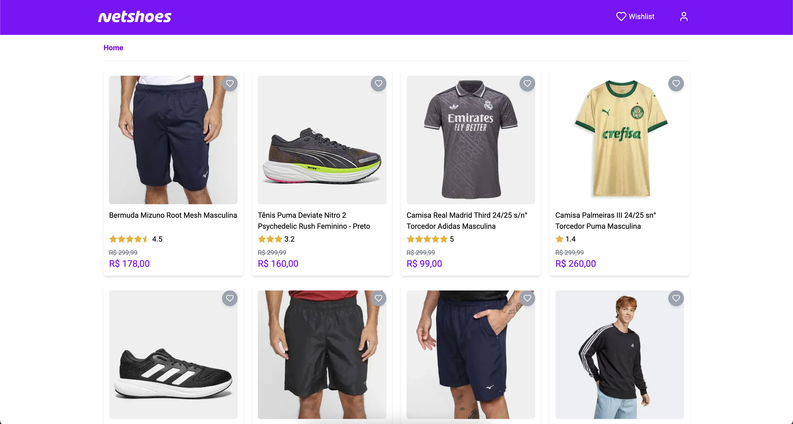

Projeto criado para o teste de frontend no Luizalabs.

Projeto feito usando Nextjs



## Setup do projeto

Primeiro, duplique o arquivo `.env.sample` e renomeie-o para `.env`. Em seguida, modifique as variáveis de ambiente para os valores desejados. Exemplo:

De

```bash
NEXT_PUBLIC_API_URL=
```

Para

```bash
NEXT_PUBLIC_API_URL="http://localhost:3001"
```

Para rodar o servidor de dev, execute o comando:

```bash
npm run dev
# or
yarn dev
# or
pnpm dev
# or
bun dev
```

Abra [http://localhost:3000](http://localhost:3000) no browser para ver o projeto rodando.

## Testes

Para os testes presentes no projeto, execute o comando:

```bash
yarn test
# or
yarn test:coverage
```
